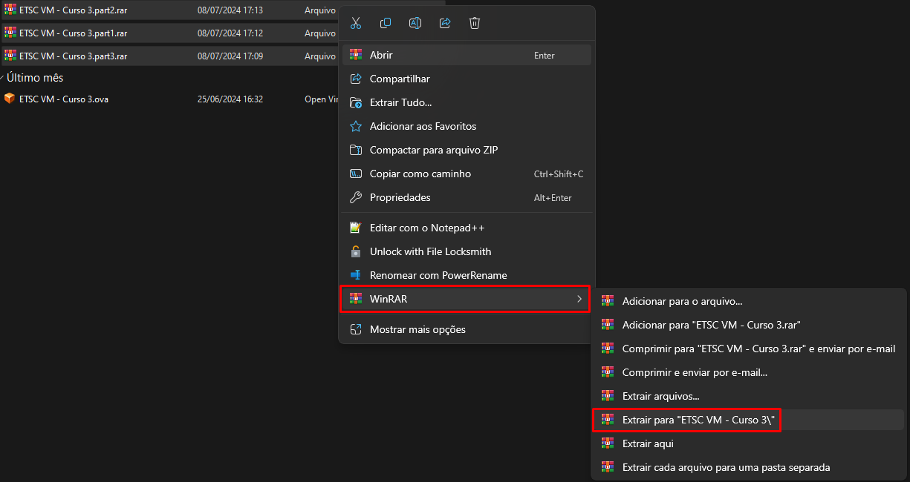

## ACESSO DA FERRAMENTA POR MEIO DE MÁQUINA VIRTUAL

Para ter acesso ao ambiente de simulação, realize o download de uma das VMs que estão disponíveis em: [Clique aqui](https://lapsicloud.ddns.net/index.php/s/riZE3Jn77CwYsGo). Selecione a que se adequa ao seu uso, as descrições delas podem ser encontradas abaixo:

**Tipo 1:** máquina completa, contando com QEMUs e Contêineres; todos os cenários estão pré-montados, mas sem configurações realizadas;

**Tipo 2:** máquina completa, contando com QEMUs e Contêineres; há necessidade de construir todos os cenários e realizar as configurações;

**Tipo 3:** máquina parcial, contando apenas com Contêineres; há necessidade de construir todos os cenários e realizar as configurações.
Dentro das pastas de cada uma das VMs, há 3 formatos de arquivos para download, `.rar`, `.zip`, `.ova`:

`.rar`: selecione simultaneamente todos os arquivos e realize a extração;

Figura 17 - Extração de arquivos .rar

`.zip`: selecione apenas o arquivo que a extensão é .zip e realize a extração, os demais arquivos serão utilizados acessados por ele;

Figura 18 - Extração de arquivos .zip

`.ova`: não há necessidade de extração.

Após a realização do download e extração, caso necessário, instale o software OracleVM VirtualBox. Abra o VirtualBox, pressione `Arquivo` → `Importar appliance` → `Escolha um arquivo para importar o appliance virtual`  → `selecione o diretório onde você salvou o arquivo da VM`   → `Abrir` → `Finalizar` → `aguarde a importação do appliance`.

Após a importação, inicie a VM e insira a senha: `etsc@lapsi`; para abrir o simulador, pressione simultaneamente `Ctrl + Alt + T` → digite `gns3` → pressione `Enter`.