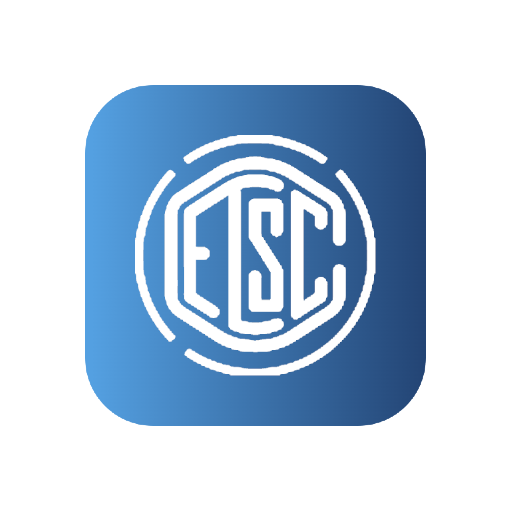

  

# ETSC

## Repositório do **Emulador para Treinamento em Segurança Cibernética (ETSC)**.

O ETSC é um projeto desenvolvido pelo **Laboratório de Processamento de Sinais e Informação (LAPSI)** da **Universidade Federal de Campina Grande (UFCG)**, em parceria com a **RNP (Rede Nacional de Pesquisa)**, voltado para treinamento em segurança cibernética. Ele utiliza o simulador GNS3 para criar cenários de aprendizado interativo.  

Atualmente, o ETSC está em sua **primeira versão** (fase de validação), com os seguintes módulos disponíveis:
- **Ferramentas para Cibersegurança**: exploração e uso de ferramentas essenciais.
- **Red Team**: estratégias e técnicas para simular ataques.
- **Blue Team**: práticas para defesa cibernética.  

Na **segunda versão**, o ETSC contará com um módulo adicional voltado para **forense digital**.

---

## Funcionalidades
- Ambiente virtualizado compatível com **Windows**, **Linux**, e **macOS**.
- Integração completa com o simulador GNS3.
- Cenários de treinamento interativo baseados em casos reais.
- Suporte à colaboração e melhoria contínua via GitHub.

---

## Como Usar o ETSC

Há três maneiras de acessar os materiais do ETSC:  

1. **Instalar o GNS3 na máquina local**: [Guia de instalação](https://github.com/LAPSI-DEE-UFCG/ETSC/blob/main/Instala%C3%A7%C3%A3o/Local.md).  
2. **Instalar o GNS3 em um servidor e disponibilizar acesso remoto**: [Guia de instalação](https://github.com/LAPSI-DEE-UFCG/ETSC/blob/main/Instala%C3%A7%C3%A3o/Servidor.md).  
3. **Utilizar a máquina virtual configurada**: [Guia de instalação](https://github.com/LAPSI-DEE-UFCG/ETSC/blob/main/Instala%C3%A7%C3%A3o/M%C3%A1quina%20Virtual.md).  

As topologias de rede para os cenários estão disponíveis nas pastas `Ferramentas`, `Red Team` e `Blue Team`. Caso esteja utilizando a máquina virtual, elas já estarão configuradas no ambiente.

A documentação completa para instalação e execução dos cenários pode ser encontrada no site oficial:
[https://etsc.cyberedu.com.br/](https://etsc.cyberedu.com.br/)  

Credenciais de visualização para usuários visitantes:  
- **Login:** visitante  
- **Senha:** V1s1t@nt3  

---

## Saiba Mais

Entre em contato caso tenha interesse em nossos cursos e treinamentos!

🔗 **Visite:** [CyberEdu](https://cyberedu.com.br/)

---

## Contribuições

Contribuições são bem-vindas! Você pode ajudar:  
- Reportando problemas por meio da aba [Issues](https://github.com/LAPSI-DEE-UFCG/ETSC/issues).  
- Sugerindo novos recursos ou melhorias.  
- Corrigindo bugs e enviando *pull requests*.

---

## Suporte e Contato

Para suporte técnico, entre em contato via e-mail: **lapsi@dee.ufcg.edu.br**  
Você também pode acompanhar o LAPSI pelas seguintes plataformas:  
- **Instagram:** [@lapsiufcg](https://www.instagram.com/lapsiufcg/)  
- **LinkedIn:** [LAPSI UFCG](https://www.linkedin.com/in/lapsi-ufcg-209577257/)  
- **DockerHub:** [LAPSI UFCG](https://hub.docker.com/u/lapsiufcg)  

Para contribuições financeiras, parcerias comerciais ou dúvidas sobre nossos cursos, acesse:  
👉 **[CyberEdu - Segurança Cibernética](https://cyberedu.com.br/)**  

---

## Licença

O ETSC é distribuído sob a licença [GPL-3.0](https://www.gnu.org/licenses/gpl-3.0.en.html).  
O uso comercial do projeto é restrito e requer autorização prévia. Para mais informações sobre a aquisição de uma licença comercial, entre em contato pelo e-mail: **lapsi@dee.ufcg.edu.br**.
